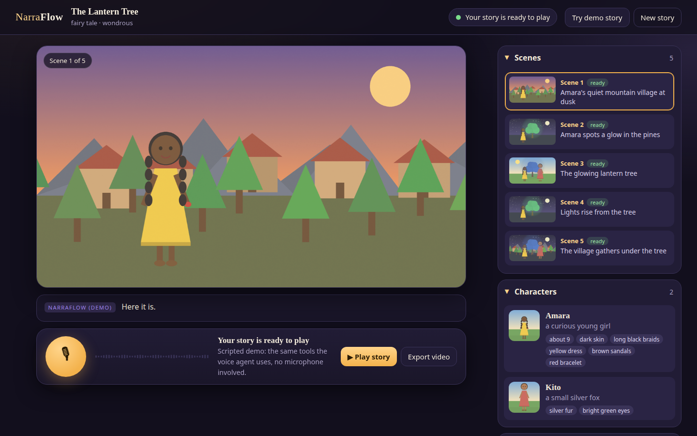
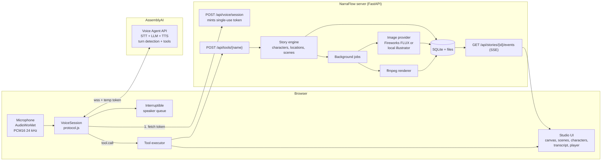
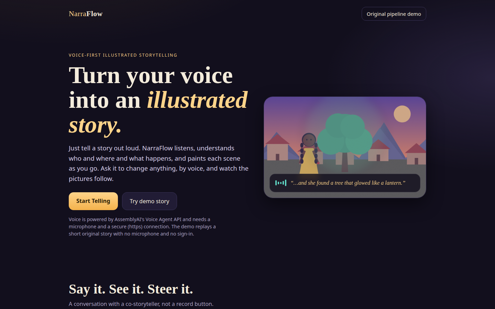
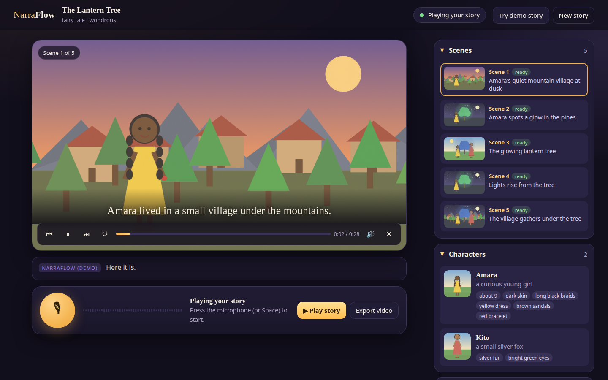
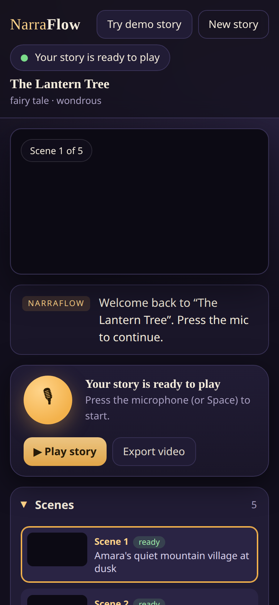

# NarraFlow: turn your voice into an illustrated story

Tell a story out loud. NarraFlow listens with the [AssemblyAI Voice Agent API](https://www.assemblyai.com/docs/voice-agents/voice-agent-api), understands the characters, places and scenes as you speak, and paints each scene as an illustration. Ask it to change anything by voice ("make the tree blue", "change her dress to green", "regenerate scene two") and watch the pictures follow. Then say "play the story" to watch it with captions and narration, or export it as a video.

Built for the **AssemblyAI Voice Agent Hackathon 2026** (lablab.ai).



## Contents

1. [Overview](#1-overview) · 2. [Why NarraFlow exists](#2-why-narraflow-exists) · 3. [How the voice experience works](#3-how-the-voice-experience-works) · 4. [Architecture](#4-architecture) · 5. [AssemblyAI integration](#5-assemblyai-integration) · 6. [Tool calling](#6-tool-calling) · 7. [Image generation pipeline](#7-image-generation-pipeline) · 8. [Illustrated video pipeline](#8-illustrated-video-pipeline) · 9. [Local setup](#9-local-setup) · 10. [Environment variables](#10-environment-variables) · 11. [Testing](#11-testing) · 12. [Deployment](#12-deployment) · 13. [Demo instructions](#13-demo-instructions) · 14. [Screenshots](#14-screenshots) · 15. [Tech stack](#15-tech-stack) · 16. [License](#16-license) · [Known limitations](#known-limitations) · [History and originality](#history-and-originality)

## 1. Overview

NarraFlow is a **voice-first illustrated storytelling app**.

- **Voice is the interface.** You talk; an AssemblyAI voice agent talks back, and can be interrupted.
- **Story understanding is the intelligence.** The agent turns narration into a structured story (characters, locations, scenes, actions, emotions, visual descriptions) by calling tools.
- **Illustration is the output.** Every scene is illustrated, characters keep a persistent look, and the result plays back as an animated storybook or exports to MP4.

It is deliberately not a generic "AI assistant that can talk": the point is *tell a story, watch it appear*.

## 2. Why NarraFlow exists

Most people tell stories far better than they draw them: a parent at bedtime, a teacher in a classroom, a child, a language learner, someone who can't easily type. Text-to-image tools ask for prompt engineering. Speaking is what people already do. NarraFlow removes the prompt: you narrate, and the system does the visual work, keeping characters and places consistent so the pictures read as one story.

Intended uses include children's storytelling, classroom visualisation, language practice, family stories, creative writing, accessibility, and content creation. These are goals, not claims about adoption or impact: nothing here has been deployed to real users.

## 3. How the voice experience works

You press the microphone once and talk. There is no record/stop/submit cycle.

- **A conversation, not a recorder.** The agent greets you, understands fragments and restarts, and replies in a sentence or two.
- **Narration vs instruction.** The system prompt teaches the agent to tell *story content* ("She walked into the forest and found a tree that glowed…") apart from *instructions* ("make the forest snowy", "regenerate scene two", "continue"). Narration is turned into scenes; instructions call editing tools.
- **Pauses are allowed.** Turn detection is tuned for storytellers (`min_silence` 1300 ms, `max_silence` 4500 ms), and the agent is told to answer an unfinished thought ("and then she…") with just "Mm-hm." and wait.
- **Interruption.** You can talk over the agent. The browser cuts the agent's audio immediately on `input.speech.started` and drops any audio of that reply still on the wire.
- **Confirmation.** Deleting a scene requires a spoken yes (`confirmed=true` is only allowed after the user agrees).
- **It never blocks.** Painting runs in the background; the agent keeps talking while scenes appear, and only announces a repaint when it is finished and you are not mid-sentence.
- **Playback mutes the mic** so the narration is not heard by the agent as you speaking.

The screen always says what is happening: `Listening…`, `Understanding your story…`, `Creating scene 2…`, `Repainting scene 3…`, `Keeping the character's look consistent in every scene…`, `Rendering your illustrated story…`.

## 4. Architecture



| Path | Role |
|---|---|
| `backend/app/studio/agent.py` | Token minting (server-side key), rate limiting, system prompt, `session.update` payload |
| `backend/app/studio/tools.py` | The 13 tools: JSON schemas + validated executors |
| `backend/app/studio/models.py` | Structured `Story`, `Character`, `Location`, `Scene` |
| `backend/app/studio/prompts.py` | Continuity prompt composer |
| `backend/app/studio/images.py` | `ImageGenerationProvider` interface, Fireworks FLUX provider, local illustrator |
| `backend/app/studio/jobs.py` | Background image jobs (caching, stale-result dropping, failure isolation) |
| `backend/app/studio/render.py` | ffmpeg export (title card, Ken Burns, burned-in captions, `.srt`) |
| `backend/app/studio/routes.py` | REST + SSE API, asset serving |
| `frontend/studio/protocol.js` | Voice Agent protocol client (pure, unit-tested) and UI state machine |
| `frontend/studio/audio.js` | Mic capture (AudioWorklet) and interruptible playback |
| `frontend/studio/player.js` | Illustrated-story player |
| `frontend/studio/app.js` | Studio controller |

## 5. AssemblyAI integration

AssemblyAI powers the whole conversational layer: speech recognition, turn detection, the reasoning LLM, tool calling and the spoken voice. NarraFlow does not do its own recording, transcription or TTS for the conversation.

1. The browser asks the NarraFlow server for a session: `POST /api/voice/session`.
2. The server calls `GET https://agents.assemblyai.com/v1/token` with `Authorization: Bearer <ASSEMBLYAI_API_KEY>` and returns a **short-lived, single-use token** plus the session config. **The permanent key never reaches the browser.** Minting is rate-limited per client.
3. The browser opens `wss://agents.assemblyai.com/v1/ws?token=…` and sends `session.update` (system prompt, verbatim greeting, turn detection, 13 tools).
4. After `session.ready` it streams `input.audio` (base64 PCM16, 24 kHz, about 50 ms chunks, echo cancellation on).
5. It handles `input.speech.started/stopped`, `transcript.user(.delta)`, `reply.started`, `reply.audio`, `transcript.agent`, `tool.call`, `reply.done`, `session.ready/updated/ended` and `session.error`.
6. **Tool results** are sent as JSON *strings* after `reply.done`, and discarded if the reply was interrupted (per the protocol).
7. **Reconnect:** if the socket drops, the client fetches a *fresh* token and sends `session.resume` (valid for 30 s); if the session is gone it starts a new one, whose prompt carries the current story outline. `session.end` is sent on stop to avoid the billable resume window.
8. **Nudges:** when a repaint or export finishes, the client uses `reply.create` to let the agent say so, but only when nobody is speaking.

Protocol reference: [Voice Agent WebSocket API](https://www.assemblyai.com/docs/voice-agents/voice-agent-api/api-spec/voice-agent-websocket).

## 6. Tool calling

Tools are defined in AssemblyAI's format (`{"type":"function","name","description","parameters"}`), executed by the browser against `POST /api/tools/{name}`, and return small JSON results (no images ever travel through the voice session). Every executor validates and tolerates sloppy LLM arguments, and returns a message the agent can say aloud when it refuses.

| Tool | What it does |
|---|---|
| `create_story` | Set title, genre, tone, language, visual style (or start a new story) |
| `add_story_content` | Record new narration as structured scenes, characters and locations; new scenes are illustrated automatically |
| `analyze_story` | Refine existing structure: fix a character or retag a scene |
| `generate_scene` | Illustrate a scene that has none (skips unchanged, already-illustrated scenes) |
| `regenerate_scene` | Repaint a scene with a revision instruction |
| `modify_character` | Change a character's persistent look; every scene with them is repainted |
| `modify_story_style` | Change style or tone; all scenes are repainted |
| `add_scene` / `remove_scene` / `reorder_scene` | Edit the sequence (removal needs a spoken confirmation) |
| `preview_story` | Return the current outline |
| `play_story` | Trigger on-screen playback |
| `export_story` | Render the MP4 in the background |

Scene numbers are 1-based, as spoken ("scene two", "the last scene").

## 7. Image generation pipeline

- **Provider interface.** `ImageGenerationProvider` (`generate_scene`, `regenerate_scene`, `generate_character_reference`, `generate_location_reference`). Choose with `IMAGE_PROVIDER`.
  - `fireworks`: real illustrations from a Fireworks-hosted FLUX model (the image model NarraFlow already used). Needs `FIREWORKS_API_KEY`.
  - `illustrator` (default): a built-in, offline, deterministic storybook illustrator (Pillow). It needs no key and reads the same structured facts, so continuity and voice edits are visible and testable. **It is placeholder-quality, not a substitute for real art.**
- **Continuity.** Each character's persistent visual traits (age, appearance, clothing) and each location's traits are injected into *every* scene prompt by `prompts.compose_scene_prompt`, plus a per-story seed. FLUX text-to-image is not reference-conditioned, so consistency is prompt-based and best-effort.
- **Voice edits propagate.** Changing a character repaints only scenes containing them; changing the style repaints all scenes; regenerating a scene bumps its revision.
- **Efficient.** A scene is only regenerated when its composed prompt changed (or on `force`), jobs run in a small thread pool, results are content-addressed and cached, and a stale result (scene edited again mid-render) is dropped.
- **Failure isolation.** A provider error marks that scene `failed` with a readable reason and a retry path; the story, the other scenes and the voice session are unaffected.

## 8. Illustrated video pipeline

- **Playback in the app:** scene transitions, Ken Burns pan/zoom, captions, spoken narration (the browser's speech synthesis, switchable), progress bar, play/pause, previous/next, replay. Playback waits for each narration to finish (with a cap) and never lets a stale speech callback skip a scene.
- **Export:** `export_story` renders an MP4 with ffmpeg: title card, each scene with a slow zoom and fades, and the storyteller's words burned in as captions, plus an `.srt`. **The exported video is silent** (no server-side TTS); narration plays in the app.

## 9. Local setup

Requirements: Python 3.11+, ffmpeg, a modern browser (Chrome, Edge, Firefox or Safari), and an AssemblyAI API key for live voice.

```bash
cd backend
python -m venv venv && source venv/bin/activate
pip install -r requirements.txt
cp .env.example .env        # then set ASSEMBLYAI_API_KEY
set -a; source .env; set +a
uvicorn app.main:app --port 8000
# open http://localhost:8000/app/   (microphone needs https or localhost)
```

No key? The scripted demo (`/app/studio.html?demo=1`) runs the whole flow without a microphone or any account.

## 10. Environment variables

| Variable | Default | Purpose |
|---|---|---|
| `ASSEMBLYAI_API_KEY` | none | **Required for live voice.** Server-side only. |
| `IMAGE_PROVIDER` | `illustrator` | `fireworks` for real illustrations |
| `FIREWORKS_API_KEY` | none | Needed when `IMAGE_PROVIDER=fireworks` |
| `FIREWORKS_IMAGE_MODEL` | `…/flux-1-schnell-fp8` | Image model |
| `ASSEMBLYAI_VOICE` | server default | Agent voice |
| `VOICE_MAX_SESSION_SECONDS` | `1800` | Session cap (60-10800) |
| `VOICE_SESSIONS_PER_HOUR` | `30` | Token-minting limit per client |
| `VOICE_MIN_SILENCE_MS` / `VOICE_MAX_SILENCE_MS` | `1300` / `4500` | Pause tolerance |
| `VOICE_TOOL_EXECUTION_MODE` | `interactive` | Or `hold` |
| `MAX_SCENES_PER_STORY` | `16` | Caps image spend per story |
| `TOOL_CALLS_PER_HOUR` / `STORIES_PER_HOUR` | `600` / `60` | Per-client limits |
| `IMAGE_WORKERS` | `3` | Parallel image jobs |
| `CORS_ORIGINS` | `*` | Lock down in production |
| `TRUST_PROXY` | off | Set behind a reverse proxy so rate limits see real IPs |
| `NARRAFLOW_DATA_DIR` | `backend/data` | SQLite, images, exports |

See `backend/.env.example`. Never commit `backend/.env`.

## 11. Testing

```bash
cd backend
pip install -r requirements-dev.txt
ruff check app tests --select E,F,W,B --ignore E501,B008     # lint
python -m pytest tests -q                                     # backend + browser end-to-end
node --test ../frontend/studio/tests/protocol.test.mjs ../frontend/studio/tests/player.test.mjs   # frontend logic
```

What is covered:

- **Voice protocol (`protocol.test.mjs`, 25 tests):** token in URL, `session.update` first, no audio before `session.ready`, tool results after `reply.done` as JSON strings, batching, discard on interruption, barge-in, dropping in-flight audio, nudges, reconnect with a fresh token and `session.resume`, fallback to a new session, giving up cleanly, auth errors, mute, PCM/base64/resampling helpers, and the UI state machine.
- **Voice server (`test_voice.py`):** token endpoint, upstream failures mapped to readable errors, the permanent key never in any response, rate limiting, `session.update` shape, tool schema validity.
- **Story engine (`test_story_tools.py`):** structured state, continuity traits in every prompt, character edits repainting only affected scenes, revisions, caching, stale-result dropping, provider failure and recovery, confirmation before deletion, reorder/insert numbering.
- **API and export (`test_api.py`):** the full demo through the real tools, SSE updates, asset path-traversal blocking, MP4 verified with `ffprobe` (1280×720 H.264, expected duration), `.srt`, rate limits, size caps, scene cap.
- **Player (`player.test.mjs`):** timeline, narration/timer interplay, pause/resume, navigation, and a regression test for a real `Illegal invocation` browser bug.
- **Browser end-to-end (`test_e2e_browser.py`, real headless Chrome with a fake microphone):** live session, mic audio on the wire, tool call to story to UI, barge-in, dropped-connection resume, missing key, permission denied, upstream failure, mobile layout, and demo to playback to export.

**What the automated tests do not prove.** The end-to-end voice tests in this suite talk to `tests/fake_assemblyai.py`, a local server implementing the *documented* protocol. They show the client speaks that protocol correctly; they are deterministic and free, so they run in CI. They are not a substitute for the real service's LLM. Separately, this build *was* tested live against the real AssemblyAI API (real key, synthesized speech, the real story engine) - see "Known limitations" below for exactly what that confirmed and what it didn't. That real-service test isn't part of the automated suite: it costs real API usage and isn't deterministic, so it was run manually rather than wired into CI.

## 12. Deployment

NarraFlow needs ffmpeg, background threads and a persistent disk (SQLite plus generated images and videos), so it deploys as a **container on a long-running host** (Render, Fly.io, Railway, a VM), not as serverless functions. The browser talks to AssemblyAI directly, so the server only handles REST, SSE and jobs.

```bash
docker build -t narraflow .
docker run --env-file backend/.env -p 8000:8000 -v narraflow-data:/data narraflow
curl localhost:8000/api/health
```

`render.yaml` is a ready Render blueprint (Docker, `/api/health` check, 5 GB disk, secrets set in the dashboard). Set `TRUST_PROXY=true` and `CORS_ORIGINS=<your https origin>`; voice requires an https origin.

**Live deployment.** This exact code (same `main`, unmodified) is deployed to a [Vercel Sandbox](https://vercel.com/docs/vercel-sandbox) - a real, persistent VM, not a serverless function, since the app needs ffmpeg, background threads and a writable disk. Verified against the live public URL with a real browser: landing page, the full scripted demo (5 scenes, 2 characters, real illustrations), a valid exported MP4, and `POST /api/voice/session` minting a real AssemblyAI token. A live voice session (real synthesized speech, real transcription shown in the UI) was also captured on this deployment.

**Duration caveat.** Vercel Sandboxes on the Hobby plan cap continuous uptime at 45 minutes per session; the underlying account is Hobby. A Pro plan (or a different always-on host, using the same Docker image via `render.yaml`) removes that cap - that's a hosting/billing decision for the project owner, not something this build can make on its own. The sandbox can be resumed on demand from its snapshot before a demo.

**Verified locally, independent of the above:** the Docker image builds, runs as a non-root user, reports healthy, generates the demo story and exports a valid MP4.

## 13. Demo instructions

**Scripted demo (no microphone, no key):** open `/app/studio.html?demo=1` or press *Try demo story*. It replays a short original story ("The Lantern Tree") through the same tools the voice agent uses: create, narrate, illustrate, a voice-style revision ("make the tree blue and more magical"), and playback. It is clearly labelled as scripted.

**Live voice demo (needs `ASSEMBLYAI_API_KEY`):**

1. Press the mic. Say: "Tell the story of a young girl named Amara who discovers a mysterious glowing tree in her village."
2. Keep narrating: "She crept closer and touched the tree, and hundreds of tiny lights floated into the sky."
3. Say: "Make the tree blue and more magical." Watch the scene repaint.
4. Say: "Change Amara's dress to green." Watch every scene with her repaint.
5. Say: "Play the story."

## 14. Screenshots

| Landing | Studio (scripted demo) |
|---|---|
|  |  |
| **Playback with captions** | **Mobile** |
|  |  |

## 15. Tech stack

- **Voice:** AssemblyAI Voice Agent API (WebSocket), Web Audio (`AudioWorklet`)
- **Backend:** Python, FastAPI, Uvicorn, Pydantic, SQLite, server-sent events
- **Images:** Fireworks FLUX (optional) or the built-in Pillow illustrator
- **Video:** ffmpeg
- **Frontend:** dependency-free ES modules, HTML, CSS (no build step)
- **Tests:** pytest, Node's built-in test runner, Playwright (drives your installed Chrome)
- **Delivery:** Docker, Render blueprint, GitHub Actions

## 16. License

[MIT](LICENSE). Runtime dependencies (FastAPI, Uvicorn, Requests, Pydantic: MIT/BSD/Apache-2.0; Pillow: HPND) are permissive and MIT-compatible.

## Known limitations

- **Tool-calling reliability against the real AssemblyAI service.** This was tested live (real API key, synthesized speech piped into a real WebSocket session, real story engine on the receiving end - not the fake test server) across 10 sessions. Findings:
  - The connection, authentication, real speech transcription, the automatic greeting, barge-in/interruption, and reconnection all worked correctly and repeatably every time.
  - Tool calling **does work**: three separate live sessions produced a real `tool.call` with correct, well-formed arguments, which our real executor processed and returned a correct result for (confirmed with `add_story_content` and `play_story`).
  - It was **not consistent turn-to-turn**. The first schema (nested `scenes`/`characters` arrays-of-objects, matching the API docs) never once triggered a tool call in five live sessions, despite being accepted without error by `session.update`. Flattening every tool to string/integer/boolean properties (see the comment above `TOOL_DEFINITIONS` in `tools.py`) and trimming property counts fixed this some of the time, but not reliably in every session tested. The system prompt in `agent.py` reflects everything learned from this testing (flat schemas, few properties per tool, explicit "you must call a tool" wording), and is a real improvement over the original, but full determinism was not reached in the time available.
  - This is disclosed here rather than glossed over. It may partly reflect the flat, TTS-synthesized test speech used (no human prosody/emphasis); a live demo with a real speaker is likely to behave differently, and did produce full working exchanges in this testing.
- Without an image API key you get the built-in placeholder illustrator, not real artwork. Character consistency with FLUX is prompt-based and best-effort.
- Exported videos are silent; narration is spoken in the app by the browser.
- No user accounts: a story is reachable by anyone who has its (long, random) id. State is a single node's SQLite and disk; rate limits are in memory; background jobs live in-process and are lost on restart.
- English-first. The voice, prompt and captions are not localised.
- The `classic.html` original pipeline is kept for reference and uses mock backends by default.

## History and originality

NarraFlow began in July 2026 as a text-to-video multi-agent demo (Director, Writer, Memory, Artist, Cinematographer). That pipeline is preserved unchanged at `/app/classic.html`. The AssemblyAI voice-agent studio (secure token flow, live voice session, tool calling, structured story engine, persistent character continuity, voice-driven editing, illustrated playback and export) was built for the AssemblyAI Voice Agent Hackathon in September 2026 and is documented above. This repository's earlier history also contained an API key in the original README, which has been removed from the working tree; that key must be revoked (see the security note in the project handoff).
